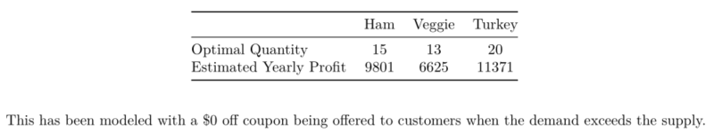

---
title: "Sandwich Sales Optimization"
author: "Partha Banerjee, Santiago Cetrangolo, Aaron Palumbo, Vincent Ying"
date: "Sunday, September 14, 2014"
output: html_document
---

James is a budding entrepreneur, and for the last two years he has been operating a sandwich stand 
in the lobby of his office building during the lunch hour. He also knows that careful data analysis 
can help him run his business more effectively. As a result, he has been tracking sandwich demand 
over the two years and he has carefully recorded the number of each type of sandwich demanded, 
the number he brought with him to sell, and his prices for each type of sandwich. 
Your job is to use the data to determine how many sandwiches of each type he should bring each 
day in order to maximize his expected profits. Two CSV files are available to support your analysis. 
The daily sales data contains number brought and number demanded for each sandwich. (Note that 
there may be days where demand exceeds supply, but James is clever and he records the requests 
he is unable to fulfill.) The pricing data contains the cost and sale price of each type of sandwich. 
Analyze the data and provide a recommendation to James. Be sure to identify any assumptions you 
make and be sure to back up your recommendations with thorough analysis. You should, as a 
group, submit a single report (expected to be 1-3 pages, but that is a guideline and not a rule) that 
provides your analysis. You may also attach any relevant code, but that is not required and will not 
be taken into account for grading purposes. 
 
 
This assignment should be submitted through the module 2 collaborative assignment mechanism in 
blackboard by end of day (11:59 p.m. EDT) on Saturday, September 27, 2014. Each group has 
its own discussion board and file share available. 

```{r echo=FALSE}

# Make sure we're in the right working directory:  "Code"

if("Code" %in% list.files()){
  setwd("Code")
}

if(!("Code" %in% list.files("..")))
{
  stop
}
```


```{r data, echo=FALSE}
# Load Data

# Start by loading the data

sales <- read.csv("../Data/sales.csv")
details <- read.csv("../Data/details.csv")
```


```{r echo=FALSE}
# Clean Data

# Add variable for total demand
sales$demand.total <- sales$demand.ham + sales$demand.turkey + sales$demand.veggie

# Add variable for profit = price - cost
details$profit <- details$price - details$cost
```

# Patterns in demand

One basic question to ask is are there any long term trends in the data, such as a rising or falling demand. With a quick scatter plot of total demand, we conclude that such a pattern does not exist

```{r echo=FALSE, fig.height=3, fig.width=6}
x <- 1:length(sales$demand.total); y <- sales$demand.total
# x <- 1:100
# y <- x
plot(x, y, main="Demand Over Time",
     xlab="Time",
     ylab="Demand")
lm1 <- lm(y ~ x)
abline(lm1, col="red")
print("95% Confidence Interval for the slope:")
confint(lm1)[2,]
```

Looking at the summary statistics for slope, we see that 0 in included in the 95% confidence interval for the slope and from that, we conclude that there is no significant long term trend in the data. Therefore, for modeling purposes, we will assume demand does not change over time.

The next step is to find a model that fits the historical data. With that model, we will then be able to predict optimal stocking levels for the future. A Poisson distribution seems like a good candidate to model the past behavior. Let's check how well the data fits. For each model we explore below we will plot the actual data points and overlay a proposed Poisson distribution.

## Total demand
```{r echo=FALSE, fig.height=3, fig.width=4}

sandwich.sales <- sales$demand.total

y.actual <- table(sandwich.sales)
y.actual <- y.actual / sum(y.actual)

x <- as.numeric(names(y.actual))

y.simulated <- dpois(x, mean(sandwich.sales))

plot(x, y.actual, main="Frequency of Total Demand",
     ylab="Probability of Occurrence",
     xlab="Daily Sandwich Demand")
points(x, y.simulated, type="l")
```

This model does a reasonable job of fitting the data, but does not give us enough fidelity to predict appropriate stocking quantities for the individual sandwich types. Let's try the same thing, but this time, we will create models for each sandwich type.

## Demand per sandwich type
```{r echo=FALSE, fig.height=2, fig.width=8}
par(mfcol = c(1, 3))

for(sandwich in c("ham", "veggie", "turkey")){
  sandwich.sales <- eval(parse(text = paste0("sales$demand.", sandwich)))
  
  y.actual <- table(sandwich.sales)
  y.actual <- y.actual / sum(y.actual)
  
  x <- as.numeric(names(y.actual))
  
  y.simulated <- dpois(x, mean(sandwich.sales))
  
  plot(x, y.actual, main=sandwich,
       xlab="Daily Demand",
       ylab="Probability of Occurence")
  points(x, y.simulated, type="l")
}

par(mfcol=c(1, 1))
```

These models appears to fit the data better than the lumped approximation and also give us enough information to predict appropriate stocking levels. Next we will see if there are even more granular patterns in the data. We will attempt to further break down demand per sandwich type by grouping by day of the week. We will show these plots for one type of sandwich, but the conclusions can be extended to all types.

## Demand per sandwich type per day of the week
```{r echo=FALSE, fig.height=4, fig.width=8}
par(mfrow = c(2, 3))

m <- seq(from=1, to = 130, by = 5)
dow <- c("Mon", "Tues", "Wed", "Thurs", "Fri")
for(d in 0:4){
  sandwich.sales <- sales$demand.veggie[m + d]  #Monday
  
  y.actual <- table(sandwich.sales)
  y.actual <- y.actual / sum(y.actual)
  
  x <- as.numeric(names(y.actual))
  
  y.simulated <- dpois(x, mean(sandwich.sales))
  
  plot(x, y.actual, main=dow[d + 1],
       xlab="Daily Demand",
       ylab="Probablility of Occurrence")
  points(x, y.simulated, type="l")
}

par(mfrow = c(1,1))
```

None of these models show good alignment between the data and the model.

## Demand broken down by the periods of differing supply

We know that while James was recording demand, he also adjusted his stocking levels. The below plot shows demand over time, overlayed with the quantity he was stocking. You can see three distince stocking levels.

```{r echo=FALSE, fig.height=3, fig.width=6}
days.range <- list(c(1, 50), c(51, 100), c(101, 130))

plot(sales$demand.veggie, main="Demand & Stock Over Time",
     xlab="Time",
     ylab="Quantity")
points(1:50, sales$available.veggie[1:50], type="l", col="blue")
points(51:100, sales$available.veggie[51:100], type="l", col="blue")
points(101:130, sales$available.veggie[101:130], type="l", col="blue")
```

The question is, does it make sense to use a different model for each of those three periods of time?

```{r echo=FALSE, fig.height=3, fig.width=8}
par(mfrow=c(1,3))

quant.stocked <- c(8, 10, 11)
i <- 1

for(days in days.range){
  sandwich.sales <- sales$demand.veggie[days[1]:days[2]]  #Monday
  
  (x <- table(sandwich.sales))
  (x <- x / sum(x))
  
  k <- as.numeric(names(x))
  
  (y <- dpois(k, mean(sandwich.sales)))
  
  plot(k, x, main=paste("Stock =", quant.stocked[i]),
       xlab="Daily Demand",
       ylab="Probability of Occurence")
  points(k, y, type="l")
  
  i <- i + 1
}

par(mfrow=c(1,1))
```

In this breakdown, we do not get good alignment between the data and the model we are proposing.

In conclusion, we find that modeling Demand per sandwich type as a Poisson distribution is the best choice.

# Profit model

In order to compare different stocking quantities, we will need to determine how to compute James' daily profit. One assumption we will make in this is that sandwiches made but not sold can not be sold on subsequent days and must be discarded. Our daily profit then becomes:

Daily profit = (sandwiches sold) * (profit per sandwich) - (sandwiches made - sandwiches sold) * (cost per sandwich)

Using the model as described above would encourage James to bring no more sandwiches than he can sell. The downside of this conservative approach is that it could, in the long run, have the effect of reducing demand for his sandwiches, as people stop coming to his sandwich stand because they can not get the sandwich they want*. To counteract this, James could offer a coupon to customers who are not able to get the sandwich they want, thereby giving them incentive to return to his stand another day. 

>*One thing to note here is that this theory is not borne out in the data. We do not see demand going down as a result of quantity stocked. However, we are only seeing a six month snapshot and this particular feedback loop could be a longer term issue. Going forward, we would recommend James continue to track demand while trying different coupon schemes.

This modified model is:

Daily profit = (sandwiches sold) * (profit per sandwich) - (sandwiches made - sandwiches sold) * (cost per sandwich) - (sandwich demand - sandwich sold) * (coupon cost)

Using this model we can simulate long term profit of different stocking quantities and determine the optimum stocking quantity for each sandwich. To generate these numbers we will use many days worth of simulated data.

## Estimated Yearly Profit by Sandwich Type
```{r echo=FALSE}
# Calculate yearly profit estimate, based on 52 * 5 = 260 days per year
days.per.year <- 52 * 5

profit.sim <- function(lambda, days, num.stocked, cost.details, coupon=c(1, 0)){
  demand <- rpois(days, lambda)
  
  number.sold <- demand
  number.sold[number.sold > num.stocked] <- num.stocked
  number.sold <- sum(number.sold)
  
  number.unsold <- sum((num.stocked - demand)[ num.stocked - demand > 0])
  
  number.unfilled <- sum((demand - num.stocked)[demand - num.stocked > 0])
  
  profit <- number.sold * cost.details$profit
  inventory.loss <- number.unsold * cost.details$cost
  # coupon.cost = # sandwiches * ($X off per sandwich OR % off per sandwich)
  #                              (1 + 0 * price) = $1 off per sandwich
  #                              (0 + 0.25 * price) = 25% off per sandwich
  #                              (0 + 0 * price) = no coupon offered
  coupon.cost <- number.unfilled * (coupon[1] + coupon[2] * cost.details$price)
  
  return((profit - inventory.loss - coupon.cost) / days * days.per.year)
}
```


```{r echo=FALSE, fig.height=3}
par(mfrow = c(1, 3))
days <- 10000

# coupon.cost = # sandwiches * ($X off per sandwich OR % off per sandwich)
#                              (1 + 0 * price) = $1 off per sandwich
#                              (0 + 0.25 * price) = 25% off per sandwich
#                              (0 + 0 * price) = no coupon offered
# Report text counts on using a $X off model. See comments below.
coupon.model <- c(1, 0)

stock.range <- 10:30      # Check results for these stocking values

for(sandwich in c("ham", "veggie", "turkey")){
  sandwich.sales <- eval(parse(text = paste0("sales$demand.", sandwich)))

  lambda <- mean(sandwich.sales)

  i = 1
  results <- vector(mode="numeric")
  for(stock in stock.range){
    results[i] <- profit.sim(lambda, days, stock, details[details$type == sandwich, ], coupon.model)
    i = i + 1
  }
  
  plot(stock.range, results, ylim=c(0, 15000), main=sandwich,
       ylab="Profit ($)",
       xlab="Daily Stocking Quantity")
  
  assign(paste0("recommendation.", sandwich), 
         list(stock.range[which(results == max(results))], round(max(results), 0)))
}
  
par(mfrow = c(1, 1))
options(scipen=999)  # Force non-scientific printing in the following table
```

|                         |            Ham            |            Veggie            |            Turkey            |
|-------------------------|:-------------------------:|:----------------------------:|:----------------------------:|
| Optimal Quantity        | `r recommendation.ham[1]` | `r recommendation.veggie[1]` | `r recommendation.turkey[1]` |
| Estimated Yearly Profit | `r recommendation.ham[2]` | `r recommendation.veggie[2]` | `r recommendation.turkey[2]` |

```{r eval=FALSE, echo=FALSE}
# This is the line in the report that causes a $X off model to be necessary
```
This has been modeled with a $`r coupon.model[1]` off coupon being offered to customers when the demand exceeds the supply.

# Validation

Finally, as a last check we will run our recommended numbers through the actual data to confirm that historically, this would have provided James with maximum profit. We can compare that to his actual profit for completeness.

```{r echo=FALSE}

profit.daily <- function(demand, stock, cost.details, coupon){
  
  number.sold <- min(demand, stock)
  
  number.unsold <- max(stock - demand, 0)
  
  number.unfilled <- max(demand - stock, 0)
  
  profit <- number.sold * cost.details$profit
  inventory.loss <- number.unsold * cost.details$cost
  # coupon.cost = # sandwiches * ($X off per sandwich OR % off per sandwich)
  #                              (1 + 0 * price) = $1 off per sandwich
  #                              (0 + 0.25 * price) = 25% off per sandwich
  #                              (0 + 0 * price) = no coupon offered
  coupon.cost <- number.unfilled * (coupon[1] + coupon[2] * cost.details$price)
  
  return(profit - inventory.loss - coupon.cost)
}

for(sandwich in c("ham", "veggie", "turkey")){
  sandwich.sales <- eval(parse(text = paste0("sales$demand.", sandwich)))
  sandwich.stock <- eval(parse(text = paste0("sales$available.", sandwich)))
  cost.details <- details[details$type == sandwich, ]
  
  profit.total <- 0
  for(i in 1:length(sandwich.sales)){
    demand <- sandwich.sales[i]
    stock <- sandwich.stock[i]
    profit <- profit.daily(demand, stock, cost.details,  c(0, 0))
    profit.total <- profit.total + profit
  }
  
  assign(paste0("profit.hist.", sandwich), profit.total / length(sandwich.sales) * days.per.year)
}

for(sandwich in c("ham", "veggie", "turkey")){
  sandwich.sales <- eval(parse(text = paste0("sales$demand.", sandwich)))
  sandwich.stock <- eval(parse(text = paste0("recommendation.", sandwich, "[[1]]")))
  cost.details <- details[details$type == sandwich, ]
  
  profit.total <- 0
  for(i in 1:length(sandwich.sales)){
    demand <- sandwich.sales[i]
    stock <- sandwich.stock
    profit <- profit.daily(demand, stock, cost.details,  c(0, 0))
    profit.total <- profit.total + profit
  }
  
  assign(paste0("profit.hist.mod.", sandwich), profit.total / length(sandwich.sales) * days.per.year)
}

```

|                         |            Ham            |            Veggie            |            Turkey            |
|-------------------------|:-------------------------:|:----------------------------:|:----------------------------:|
| Actual Projected Yearly Profit | `r profit.hist.ham` | `r profit.hist.veggie` | `r profit.hist.turkey` |
| Projected Yearly Profit with Recommended Stocking Quantities | `r profit.hist.mod.ham` | `r profit.hist.mod.veggie` | `r profit.hist.mod.turkey` |

# Conclusion and Recommendations

Based on the above analysis, it is our recommendation that James stock the following quantities of sandwich:

|                         |            Ham            |            Veggie            |            Turkey            |
|-------------------------|:-------------------------:|:----------------------------:|:----------------------------:|
| Optimal Quantity        | `r recommendation.ham[1]` | `r recommendation.veggie[1]` | `r recommendation.turkey[1]` |
| Estimated Yearly Profit | `r recommendation.ham[2]` | `r recommendation.veggie[2]` | `r recommendation.turkey[2]` |

This has been modeled with a $`r coupon.model[1]` off coupon being offered to customers when the demand exceeds the supply.

It is interesting to note that our recommendations produces a lower profit for Ham than what James achieved on his own. This can be explained in two ways:

First, by offering a coupon, our model includes a penalty for not meeting demand, which is intended to increase customer retention. If we look at our model without offering that coupon we have:



This "No Coupon" model, as expected, produces higher profits, and the profits exceed what James was able to achieve independently, but, as discussed above, risks loosing customers.

Second, our model is an estimate of actual demand, which can vary on a yearly basis. We would recommend James continue to collect data and periodically refine the model to produce more accurate estimates of and capture any long term changes in demand.

In addition, as discussed above, we would recommend James continue to track demand while trying different coupon schemes. In the future, an optimal coupon scheme can be determined.

